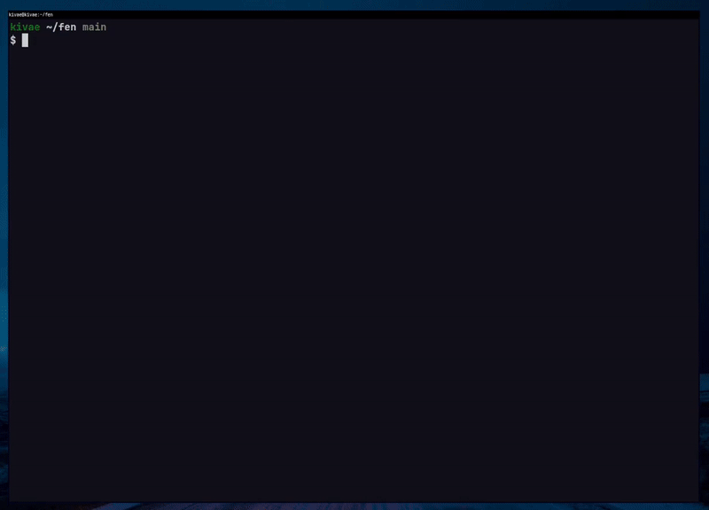

# fen
fen is a terminal file manager inspired by [ranger](https://github.com/ranger/ranger)\
Works for Linux & Windows


<p float="left">


</p>

# Try it out now!
```
go run github.com/kivattt/fen@latest
```

# Building
```
go build
./fen
```

# Controls
Arrow keys, hjkl or scrollwheel to navigate (Enter goes right), Escape key to cancel an action

`Home` or `g` to go to the top \
`End` or `G` to go to the bottom \
`M` Go to the middle \
`H` Go to the top of the screen \
`L` Go to the bottom of the screen \
`q` Quit \
`Del` Delete file(s) \
`y` Copy file(s) \
`d` Cut file(s) \
`p` Paste file(s) \
`/` Search file \
` ` Select files \
`A` Flip selection in folder (select all files) \
`D` Deselect all, and un-yank \
`a` Rename a file \
`z` Toggle hidden files \
`V` Start selecting by moving \
`n` Create a new file (touch) \
`N` Create a new folder (mkdir) \
`?` Toggle file properties window

# Configuration
fen looks for a config file at `~/.config/fen/fenrc`. Here is an example config file:
```
# Borders around the filepanes
gui-borders: yes

# A "safe mode", no file write operations will be performed when set to yes
no-write: no
```
(These 2 are the only options so far)

You can specify a different config file with the `--config` flag

# Known issues
- `go test` doesn't work on Windows
- The color for audio files is invisible in the default Windows Powershell colors, but not cmd or Windows Terminal
