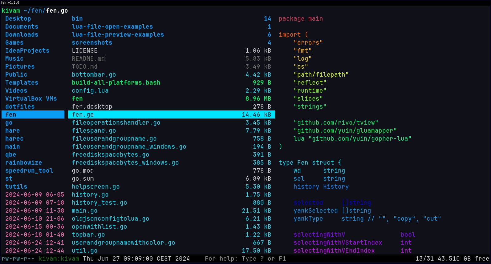
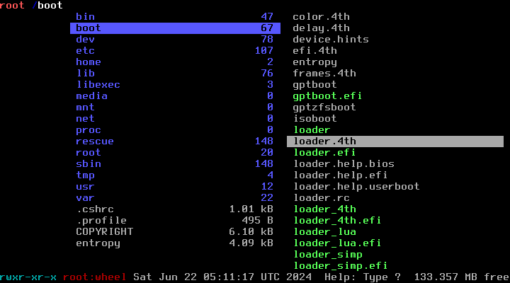
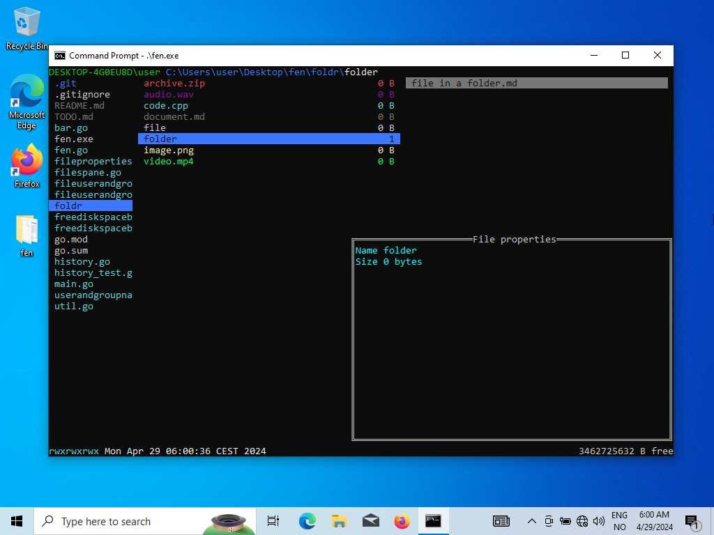

# fen

[](https://goreportcard.com/report/github.com/kivattt/fen)

fen is a terminal file manager inspired by [ranger](https://github.com/ranger/ranger)\
Works for Linux, macOS, FreeBSD and Windows

<p float="left">




</p>

# Try it out now!
```
go run github.com/kivattt/fen@latest
```

# Installing on Linux/FreeBSD
Download the latest version in the [Releases](https://github.com/kivattt/fen/releases) page, and put it inside `/usr/local/bin`

Alternatively:
```
sudo -i GOBIN=/usr/local/bin go install github.com/kivattt/fen@latest
```

# Building
```
go build
./fen
```

# Controls
Arrow keys, hjkl or scrollwheel to navigate (Enter goes right), Escape key to cancel an action

`Ctrl + Space` Open file(s) with specific program \
`Home` or `g` to go to the top \
`End` or `G` to go to the bottom \
`M` Go to the middle \
`H` Go to the top of the screen \
`L` Go to the bottom of the screen \
`q` Quit \
`Del` Delete file(s) \
`y` Copy file(s) \
`d` Cut file(s) \
`p` Paste file(s) \
`/` Search file \
` ` Select files \
`A` Flip selection in folder (select all files) \
`D` Deselect all, and un-yank \
`a` Rename a file \
`z or Backspace` Toggle hidden files \
`V` Start selecting by moving \
`n` Create a new file (touch) \
`N` Create a new folder (mkdir) \
`?` Toggle file properties window

# Configuration
Linux/FreeBSD: `~/.config/fen/fenrc.json` or `$XDG_CONFIG_HOME/fen/fenrc.json` if `$XDG_CONFIG_HOME` set \
macOS: `$HOME/Library/Application Support/fen/fenrc.json` \
Windows: `%AppData%\Roaming\fen\fenrc.json`

The `"open-with"` file matching starts from the top, so you can have something like this at the end of the list to catch anything not previously matched:
```json
{
    "programs": ["vim -p"],
    "match": ["*"]
}
```

You can find a complete example config in the [fenrc.json](fenrc.json) file \
You can specify a different config file path with the `--config` flag

# Known issues
- Setting a boolean command-line flag to false, e.g. `--no-write=false` has no effect, and the configuration file value will be prioritized. You can disable loading the config file by giving a bogus filename: `--config=aaaaa`
- `go test` doesn't work on Windows
- The color for audio files is invisible in the default Windows Powershell colors, but not cmd or Windows Terminal
- The color for Yes/No buttons when deleting files is invisible in the Linux "Ctrl+Alt+F1" rerminal, aswell as FreeBSD

See [TODO.md](TODO.md) for other issues and possible future features, roughly sorted by priority
